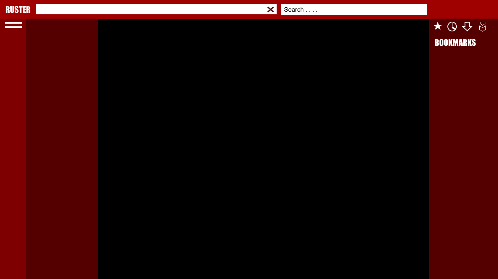

# Ruster
Webbrowser written in Rust for RedoxOS

## Goals

+ Webbrowser is written in Rust

## Features

+ Fully Browser is written in Rust
+ HTML 5, JavaScript and Dart is supported
+ Web Developers Tool Support
+ Addons and Themes Support
+ Graphics support via Vulkan or maybe WebGL
+ Sandbox Security System (for better Security!)

## Building the Binary

+ Atom /Visual Code / Sublime / QT 5.9
+ 

## Conceptual Design UI

+ Clean
+ Easy
+ 

