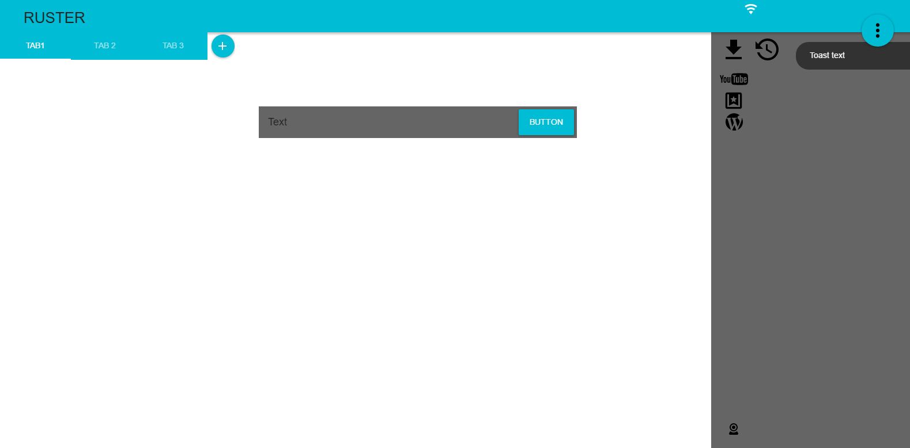

# Ruster
Webbrowser written in Rust for RedoxOS

## Goals

+ Webbrowser is written in Rust or
+ it is or could be a modified Servo Browser (Engine)

## Features

+ Fully Browser is written in Rust
+ HTML 5, JavaScript and Dart is supported
+ Web Developers Tool Support
+ Addons and Themes Support
+ Graphics support via Vulkan or maybe WebGL
+ Sandbox Security System (for better Security!)

## Building the Binary

+ Atom / Visual Code / Sublime / QT 5.9
+ 

## Conceptual Design UI

+ Clean
+ Easy
+ Modified "Servo-Browser" UI
  + so its much colorful
  + "UI Color Theme optional settings", some kind of that way! like in windows, where u can change the colors of the tabbar and windows
  

